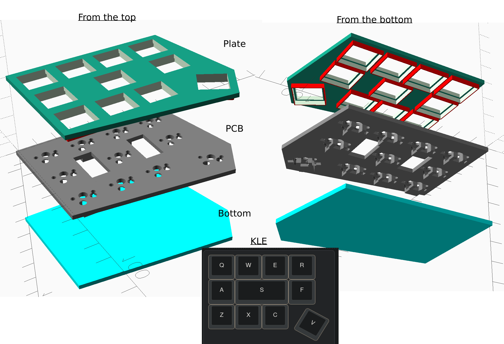
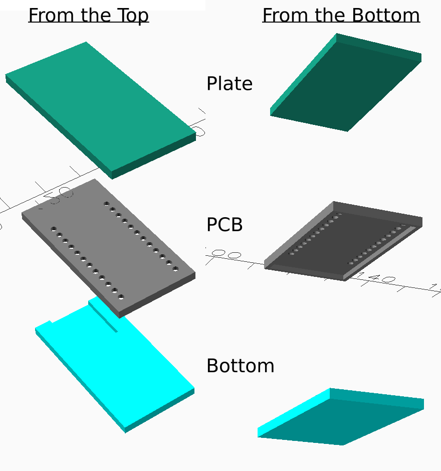
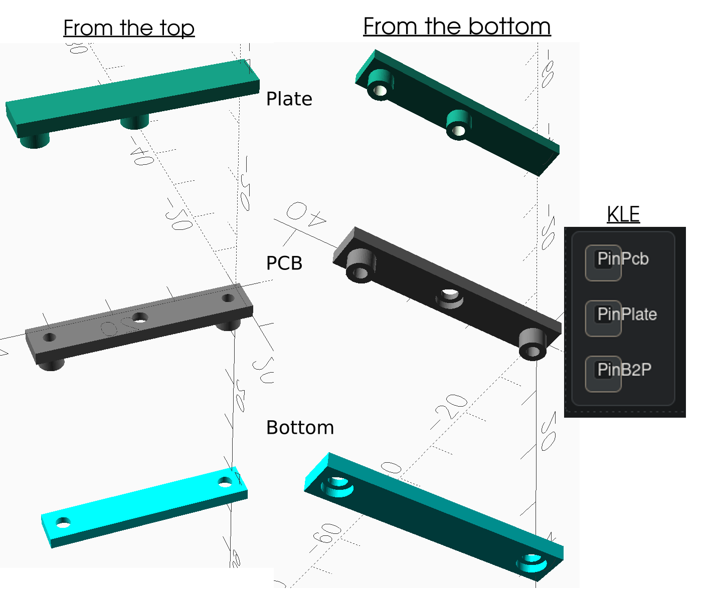
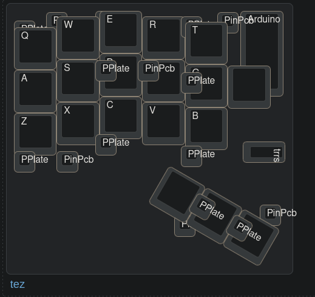
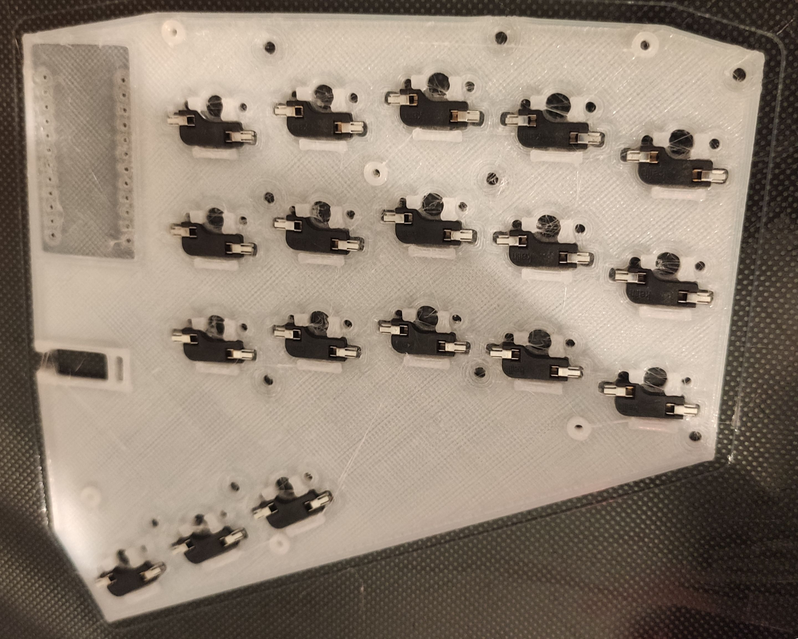
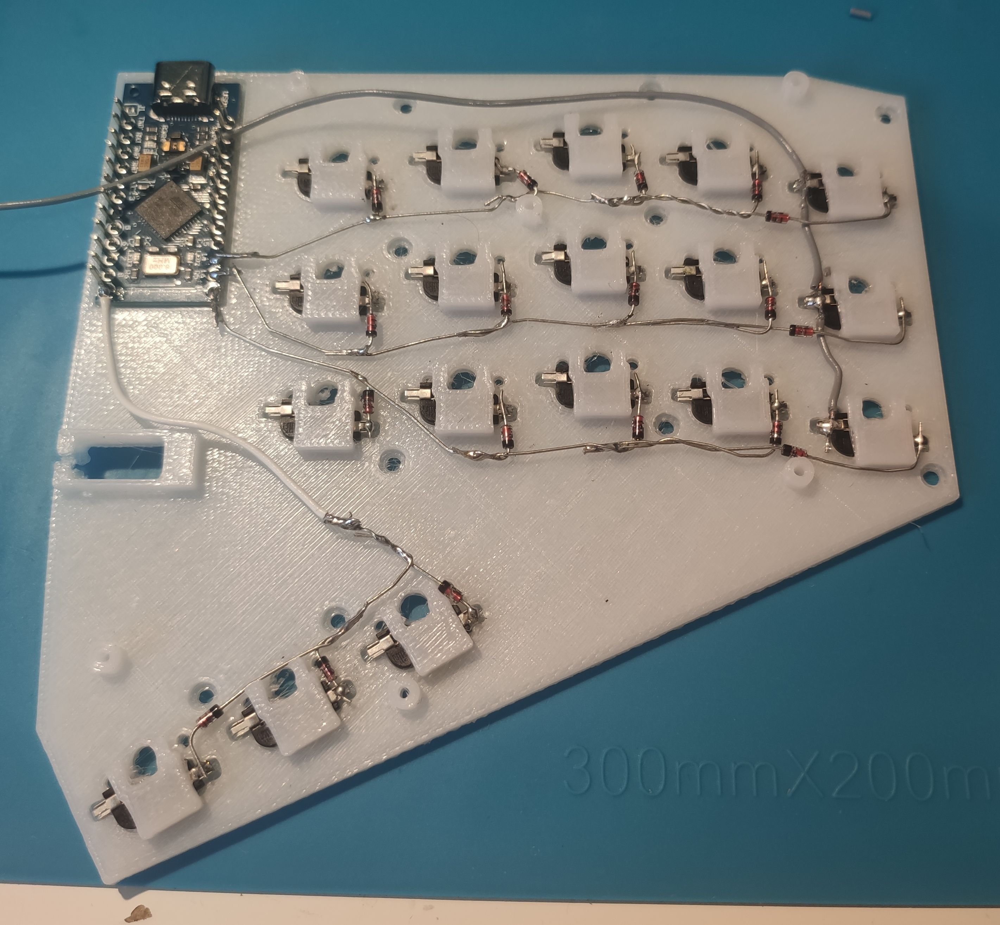
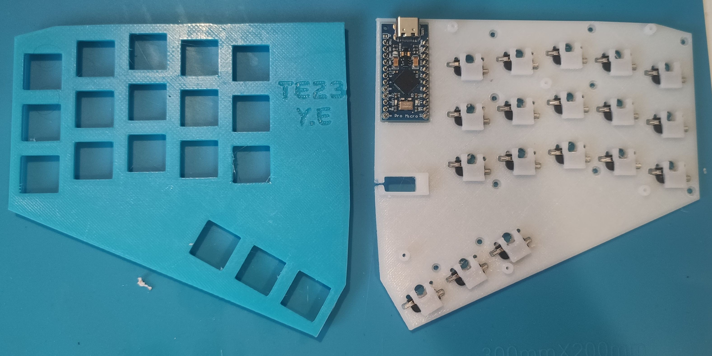
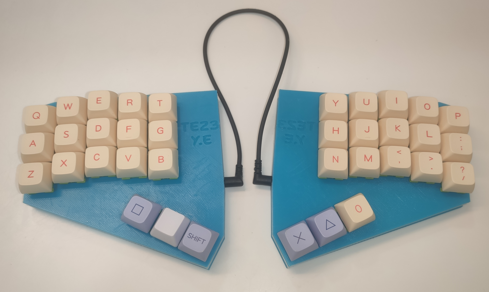

# 3D Keyboard Builder

## Motivation (Short Version)

After experimenting with various custom keyboards, including the Ergodox and my own hand-built designs, I realized I wanted something more flexible and hot-swappable. My journey led me to a project that inspired me to create my own fully customizable keyboard, allowing me to test different layouts and components. This project not only solves my ergonomic needs but also provides the creative freedom to explore new features. <F12>

[Go here to read the full motivation story](#motivation-\(full-version\))


## Project Description

This application takes a JSON file output from KLE and generates three STL files that are ready for 3D printing:
1. **Plate**: The top layer that holds the switches.
2. **PCB**: The layer designed to house the electronic components.
3. **Bottom**: The bottom layer, which encloses the keyboard.

The script processes each element of the KLE JSON to create a precise, functional 3D model for your custom keyboard.

## Supported Parts

### Keys
- **Cherry MX switches**
```json
[{sm:"cherry",a:7},"Q","W","E","R"],
["A",{w:2},"S","F"],
["Z","X","C"],
[{r:30,y:-3,x:4.25},"V"]
```


### Arduino
- **Arduino** with Type C connection support
```json
[{y:0.2,x:5.9,sm:"arduino",a:5,h:2},"Arduino"]
```


### Pins (Layer Connectors)
- Pins act as placeholders for screws, providing modular assembly of keyboard layers.
- **Pin Types**:
  - **PinPcb**: Connects the Bottom layer to the PCB.
  - **PinPlate**: Connects the PCB to the Plate.
  - **PinB2P**: Direct connection between the Bottom layer and the Plate.
```json
[{sm:"pinpcb",w:0.5,h:0.5},"PinPcb"],
[{y:-0.25,sm:"pinplate",w:0.5,h:0.5},"PinPlate"],
[{y:-0.25,sm:"pinb2t",w:0.5,h:0.5},"PinB2P"]
```



### Split Keyboard Connector
- **TRRS Connector**: Support for split keyboard designs with TRRS connections.

### Text
- Custom text can be engraved onto the plate.

## Real Keyboard Examples

### TEZ3 (Travel Easy Gen 3)

```json
[{x:1.9,sm:"pinplate",w:0.5,h:0.5},"PPlate",{x:-0.4,sm:"cherry"},"E",{x:2.3,sm:"arduino",a:5,h:2},"Arduino"],
[{y:-0.97,x:0.75,sm:"pinpcb",a:4,w:0.5,h:0.5},"PinPcb",{x:3.5,w:0.5,h:0.5},"PinPcb"],
[{y:-0.9,x:1,sm:"cherry"},"W",{x:1},"R",{x:-0.1,sm:"pinplate",w:0.5,h:0.5},"PPlate"],
[{y:-0.9,w:0.5,h:0.5},"PPlate"],
[{y:-0.98,x:4,sm:"cherry"},"T"],
[{y:-0.87},"Q"],
[{y:-0.38,x:2},"D"],
[{y:-0.87,x:1},"S",{x:1},"F"],
[{y:-0.98,x:1.9,sm:"pinplate",w:0.5,h:0.5},"PPlate",{x:0.5,sm:"pinpcb",w:0.5,h:0.5},"PinPcb"],
[{y:-0.9,x:4,sm:"cherry"},"G"],
[{y:-0.97,x:5,p:"TEZ3\\n  Y.E",sm:"platetext",a:7},""],
[{y:-0.9,sm:"cherry",a:4},"A"],
[{y:-0.95,x:3.9,sm:"pinplate",w:0.5,h:0.5},"PPlate"],
[{y:-0.43,x:2,sm:"cherry"},"C"],
[{y:-0.87,x:1},"X",{x:1},"V"],
[{y:-0.88,x:4},"B"],
[{y:-0.87},"Z"],
[{y:-0.5,x:1.9,sm:"pinplate",w:0.5,h:0.5},"PPlate"],
[{y:-0.73,x:3.9,w:0.5,h:0.5},"PPlate"],
[{y:-0.87,w:0.5,h:0.5},"PPlate",{x:0.5,sm:"pinpcb",w:0.5,h:0.5},"PinPcb"],
[{y:0.25,x:5.75,w:0.5,h:0.5},"PinPcb"],
[{y:-0.75,x:3.75,w:0.5,h:0.5},"PinPcb"],
[{r:30,rx:5,ry:3.25,y:1,x:-1,sm:"cherry",a:7},"","",""],
[{y:-0.8,x:-0.1,sm:"pinplate",a:4,w:0.5,h:0.5},"PPlate",{x:0.5,w:0.5,h:0.5},"PPlate"],
[{r:90,rx:5.25,ry:1.2,y:-1.1,x:1.85,sm:"trrs",a:5,w:0.5},"trrs"]
```







### How to add new part:
WIP


## Left Over:
* Support Kailh switch (Low Profile)
* JSON input

## Motivation (Full Version)

In 2020, my brother gave me his Ergodox keyboard [here’s a picture of the Ergodox](Documents/ergodox.jpg). At first, I struggled to find a comfortable configuration, constantly tweaking the settings every 10 minutes. I limited myself to using the Ergodox for 30 minutes daily since it reduced my work performance. After a few weeks, however, I became comfortable and switched to using the Ergodox full-time.

When my job announced that we needed to return to the office, I decided to build my own keyboard—one for home and one for the office. I wanted to keep it as affordable as possible, so I bought a bamboo cutting board from IKEA, a plate, keys, and keycaps from AliExpress. I carved out space in the cutting board for the plate and keys, which took over 4 hours. Then, I hand-wired all the keys and called the keyboard "TEZ" (Travel Easy). After using it for a few months, I realized I didn’t really like it and went back to carrying my Ergodox everywhere.

During this time, I learned a few things:
1. I prefer fewer keys and now use just 36.
2. To comfortably use the three thumb keys, I needed to shift them slightly to the right (on the left side of the keyboard).
3. I wanted the keys to be hot-swappable.

After a lot of research, I found a project called 3D-Printable Hotswap Keyboard PCB Generator. The creator, 50an6xy06r6n, came up with a clever way to achieve hot-swappability by using diodes and column wires. I printed and soldered the parts and started using it. At first, I really liked it, but after a few months, some keys would stop working unless I pressed them hard, which became frustrating. Eventually, I gave up on it and returned to the Ergodox at home and work.

At this point, I realized I had two options:

1. Learn how to create a PCB and design the keyboard I wanted.
2. Start a new project similar to 50an6xy06r6n’s, but instead of using diodes and wires to connect the columns, use a proper hot-swappable connector.

Long story short, I decided to create my own project. There were several reasons: I wasn’t sure which layout I wanted, and I didn’t want to waste money on unwanted PCBs. By creating my own project, I could easily try different components like an LCD or a joystick. I chose Python and pythonsolid2 for my project because I don’t really like OpenSCAD and enjoy the flexibility Python provides.
